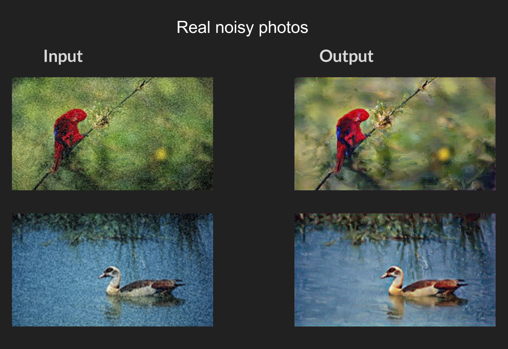

# Image Denoising with GAN

## Introduction

Path tracing is a rendering technique used in high end animation studios such as Pixar and DreamWorks to produce photorealistic frames. It works by emitting thousands of Monte Carlo rays per pixel. These rays interact with objects in the scene through reflection, refraction, and absorption, and the returned colors are averaged to compute each pixel's final value. This produces accurate results, but it is computationally expensive, and rendering a single frame can take 8 to 16 hours.

This project looks at a Generative Adversarial Network (GAN) approach to denoising as a way to speed up that process. Instead of requiring tens of thousands of samples per pixel (for example, 32K spp), the renderer only needs to output a noisy image at 4 to 8 spp. The GAN then reconstructs that into a high quality, photorealistic image in a fraction of a second, cutting rendering time down from hours to seconds.

## Installation

**Requirements:**
- Python 3.10
- TensorFlow (v1.0 or v1.1)
- PIL
- [Checkpoint file](https://uofi.box.com/shared/static/21a5jwdiqpnx24c50cyolwzwycnr3fwe.gz)
- [Dataset](https://uofi.box.com/shared/static/gy0t3vgwtlk1933xbtz1zvhlakkdac3n.zip)

## Dataset

For training, 40 images were sampled from Pixar titles. Noise was synthesized by adding Gaussian perturbations across a 5x5 grid of standard deviation settings, five sets spanning five sigma values each, which produced 1,000 training samples in total (40 times 25).

For validation, 10 images not included in the training set were used with Gaussian noise applied. The test set includes both synthetically noised images and real path traced noisy renders.

## Running

1. Download the dataset and extract it into a folder named `dataset` in the project directory.
2. Extract the checkpoint files into a folder named `Checkpoints`.
3. Run the main script:
```bash
   python3 main.py
```
4. Open a browser and navigate to:
   - `localhost:8888` if running locally
   - `[ip-address]:8888` if running on a server

## Hyperparameters

| Parameter | Value |
|---|---|
| Iterations | 10K |
| Adversarial loss factor | 0.5 |
| Pixel loss factor | 1.0 |
| Feature loss factor | 1.0 |
| Smoothness loss factor | 0.0001 |

## Results

Denoising applied to real noisy renders:



## Reference

- [SRGAN](https://arxiv.org/pdf/1609.04802.pdf)
- [Creating Photorealistic Images from Game Boy Camera](http://www.pinchofintelligence.com/photorealistic-neural-network-gameboy/)
